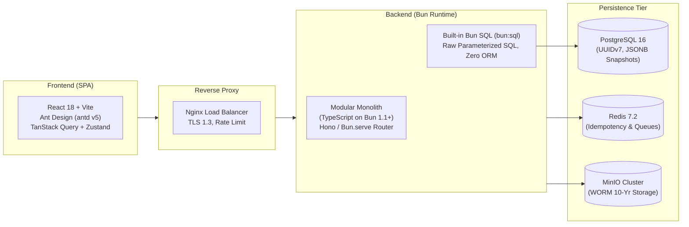

# NusaProc — Nusanet Procurement System

[](LICENSE)
[](https://bun.sh)
[](https://www.typescriptlang.org)
[](https://www.postgresql.org)
[](https://ant.design)

Sistem pengadaan barang dan jasa internal terintegrasi untuk **PT Media Antar Nusa (Nusanet)**. NusaProc menggantikan proses pengadaan manual (chat, email, spreadsheet) menjadi satu *single source of truth* dengan penegakan kepatuhan, *Separation of Duties (SoD)* otomatis, pencegahan *fraud*, audit trail kriptografis, dan kalkulasi pajak presisi.

---

## 📌 Dokumentasi Utama

* 📋 [**Product Requirements Document (PRD)**](prd.md): 65 kebutuhan terperinci (R1–R65), 7 persona (DEC-032), dan Acceptance Criteria konkret.
* 🔧 [**Technical Design Document (TDD)**](tdd.md): Desain arsitektur lengkap, DDL database PostgreSQL, 5-layer SoD engine, REST API & Webhook specs, dan arsitektur UI Ant Design.

---

## 🏗️ Arsitektur & Tech Stack



### Komponen Kunci
* **Backend**: TypeScript dieksekusi di runtime **Bun (v1.1+)** dengan router **Hono / Bun.serve**.
* **Database Access**: **Built-in Bun SQL (`bun:sql`)** menggunakan **Raw Parameterized SQL** (Zero ORM) untuk performa instan dan pencegahan SQL Injection bawaan.
* **Database**: **PostgreSQL 16** dengan Primary Key `UUIDv7`, tipe data moneter `NUMERIC(18,2)`, dan audit trail append-only.
* **Frontend**: **React 18 + Vite** dengan design system **Ant Design (antd v5)** dan lokalitas Bahasa Indonesia (`id_ID`).
* **Object Storage**: **MinIO** On-Premise dengan kebijakan retensi WORM 10 tahun (UU KUP Pasal 28).
* **Keamanan & Kontrol**: Penegakan 5-layer security interceptor (*Auth $\rightarrow$ RBAC $\rightarrow$ SoD Matrix $\rightarrow$ Scope/Delegation $\rightarrow$ Step-Up Re-auth*).

---

## 🔄 Alur Inti Pengadaan

```
Permintaan (PR) ➔ Persetujuan Berjenjang ➔ Sourcing & PO ➔ Penerimaan (BAST) + Upload Invoice ➔ 2-Way Matching ➔ Persetujuan Bayar ➔ Eksekusi Pembayaran ➔ Penilaian Pemasok
```

1. **Purchase Request (PR)**: Multi-item dengan penanda cara bayar wajib ("Bayar Dimuka/COD" vs "Bayar Setelah Terima"). Tanpa jalur revisi (PR ditolak wajib buat baru).
2. **Purchase Order (PO)**: Terbit hanya jika vendor lolos verifikasi rekening bank ganda (*4-eyes principle*). Pembuat PO dilarang menyetujui PO yang sama.
3. **Goods Receipt (BAST)**: Penerimaan barang/jasa langsung disertai unggahan invoice vendor.
4. **2-Way Matching Engine**: Komparasi otomatis baris PO vs Invoice dengan batas toleransi selisih $\le 1\%$ atau $\le \text{Rp } 100.000$.
5. **Maker-Checker-Executor Payment**: Tiga orang terpisah untuk mengajukan, memeriksa, dan mentransfer dana, dilengkapi *idempotency lock* bebas transfer ganda.

---

## 🚀 Memulai Pengembangan (Quick Start)

### Prasyarat
- [Bun](https://bun.sh) (v1.1.0 atau lebih baru)
- [PostgreSQL](https://www.postgresql.org) (v16+)
- [Redis](https://redis.io) (v7.2+)

### Instalasi & Setup

```bash
# Clone repository
git clone git@github.com:wardix/nusaproc.git
cd nusaproc

# Jalankan test suite dengan Bun (TDD Protocol)
bun test
```

---

## 📄 Lisensi
Hak Cipta © 2026 PT Media Antar Nusa (Nusanet). Berlisensi di bawah [MIT License](LICENSE).
