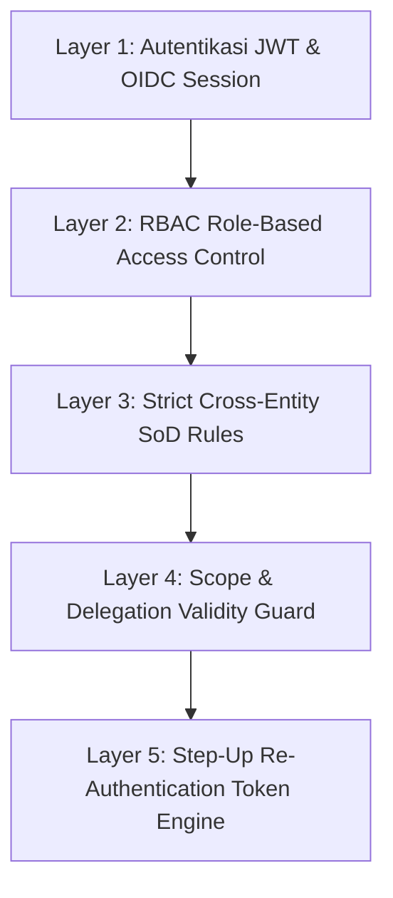
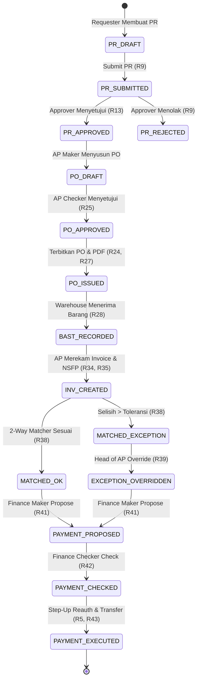

# 📘 NusaProc — Manual Pengguna & Standar Operasional Prosedur (SOP)
### Platform Tata Kelola Pengadaan Terintegrasi PT Nusanet
**Versi:** 1.0.0 | **Klasifikasi:** Dokumen Internal PT Nusanet | **Tanggal Efektif:** 2026-08-24

---

## 📑 Daftar Isi
1. [Ringkasan Eksekutif & Arsitektur Sistem](#1-ringkasan-eksekutif--arsitektur-sistem)
2. [Prinsip Inti Tata Kelola & Keamanan (5-Layer SoD Engine)](#2-prinsip-inti-tata-kelola--keamanan-5-layer-sod-engine)
3. [Standar Operasional Prosedur (SOP) Berdasarkan Peran (7 Personas)](#3-standar-operasional-prosedur-sop-berdasarkan-peran-7-personas)
   - [3.1. SOP Pemohon Pengadaan (REQUESTER)](#31-sop-pemohon-pengadaan-requester)
   - [3.2. SOP Pejabat Penyetuju (APPROVER)](#32-sop-pejabat-penyetuju-approver)
   - [3.3. SOP Staf Account Payable (ACCOUNT_PAYABLE - Maker)](#33-sop-staf-account-payable-account_payable---maker)
   - [3.4. SOP Kepala Bagian AP (ACCOUNT_PAYABLE - Checker / Head of AP)](#34-sop-kepala-bagian-ap-account_payable---checker--head-of-ap)
   - [3.5. SOP Petugas Gudang & Logistik (WAREHOUSE)](#35-sop-petugas-gudang--logistik-warehouse)
   - [3.6. SOP Eksekutor Keuangan & Kas (FINANCE - Treasury)](#36-sop-eksekutor-keuangan--kas-finance---treasury)
   - [3.7. SOP Auditor Internal & Kepatuhan (AUDITOR)](#37-sop-auditor-internal--kepatuhan-auditor)
   - [3.8. SOP Administrator Sistem (ADMIN)](#38-sop-administrator-sistem-admin)
4. [Lembar Acuan Cepat Aturan Bisnis (Business Rules Cheat Sheet)](#4-lembar-acuan-cepat-aturan-bisnis-business-rules-cheat-sheet)
   - [4.1. Matriks Larangan Konflik Pemisahan Tugas (SoD Matrix)](#41-matriks-larangan-konflik-pemisahan-tugas-sod-matrix)
   - [4.2. Format Validasi Nomor Seri Faktur Pajak (NSFP)](#42-format-validasi-nomor-seri-faktur-pajak-nsfp)
   - [4.3. Batasan Ambang Toleransi 2-Way Matcher](#43-batasan-ambang-toleransi-2-way-matcher)
   - [4.4. Diagram Siklus Hidup Dokumen Transaksi](#44-diagram-siklus-hidup-dokumen-transaksi)

---

## 1. Ringkasan Eksekutif & Arsitektur Sistem

**NusaProc** adalah sistem enterprise governance pengadaan barang dan jasa (*procure-to-pay*) yang dirancang khusus untuk memastikan akuntabilitas, integritas data tak terbantahkan (*non-repudiation*), dan kepatuhan perpajakan di lingkungan **PT Nusanet**.

Platform ini menggabungkan:
- **Pemisahan Tugas 5 Lapis (5-Layer Separation of Duties)** untuk mencegah *fraud*, *self-approval*, dan manipulasi pembayaran.
- **Engine Pencocokan 2-Arah (2-Way Matching Engine)** dengan toleransi presisi desimal Rupiah.
- **Audit Trail Kriptografis Berantai SHA-256** berbasis konsep *Write Once, Read Many* (WORM).
- **Verifikasi 4-Mata (4-Eyes Principle)** pada pendaftaran nomor rekening bank vendor.
- **Step-Up Re-Authentication (R5, R43)** yang mewajibkan otentikasi ulang saat aksi bernilai tinggi atau transfer kas dieksekusi.

---

## 2. Prinsip Inti Tata Kelola & Keamanan (5-Layer SoD Engine)



1. **Layer 1 (Identity & Session):** Memverifikasi identitas pengguna melalui tanda tangan digital JWT HS256/RS256.
2. **Layer 2 (RBAC Role Filter):** Memastikan aksi hanya dapat dijalankan oleh peran (*role*) yang berhak.
3. **Layer 3 (Cross-Entity SoD Conflict Guard):** Mencegah konflik kepentingan:
   - Pembuat PO tidak boleh menyetujui PO yang dibuatnya sendiri (**R25**).
   - Pemverifikasi Rekening Tahap 1 tidak boleh memverifikasi Tahap 2 (**R18**).
   - Pembuat Proposal Pembayaran tidak boleh memeriksa proposalnya sendiri (**R42**).
4. **Layer 4 (Scope & Delegation Guard):** Memeriksa masa berlaku delegasi wewenang (**R4, R62**) dan memastikan transaksi dalam divisi/cabang yang sah.
5. **Layer 5 (Step-Up Re-Auth Engine):** Mengharuskan verifikasi sandi/TOTP saat mengeksekusi transfer dana (**R5, R43**) atau menyetujui PO bernilai tinggi.

---

## 3. Standar Operasional Prosedur (SOP) Berdasarkan Peran (7 Personas)

### 3.1. SOP Pemohon Pengadaan (`REQUESTER`)
*Persona Standar:* **Budi Santoso** (`budi.santoso@nusanet.net.id`) — *Staff IT Infrastructure*

#### 🎯 Tugas Utama:
Membuat dokumen Permintaan Pembelian (*Purchase Request* / PR), menentukan termin pembayaran, melengkapi spesifikasi barang/jasa, dan mengajukan ke persetujuan atasan.

#### 📋 Langkah Operasional:
1. **Navigasi Menu:** Buka menu navigasi kiri $\rightarrow$ pilih **Permintaan Pembelian (PR)** $\rightarrow$ klik tombol **+ Buat PR Baru**.
2. **Pengisian Formulir Utama:**
   - **Cost Center:** Pilih kode pusat biaya yang sesuai (contoh: `CC-IT-INFRA`).
   - **Divisi & Cabang:** Sistem secara otomatis mendeteksi divisi (`DIV-IT`) dan cabang (`HQ_MEDAN`).
   - **Tanggal Diperlukan:** Tentukan tanggal target kedatangan barang (minimal $H+3$ hari kerja).
   - **Termin Pembayaran:**
     - `PAY_AFTER_RECEIPT`: Pembayaran tempo (Net 30/60) setelah barang diterima dan BAST terbit (**R8**).
     - `ADVANCE_OR_COD`: Pembayaran uang muka / cash on delivery (wajib menyertakan justifikasi tertulis **R8**).
   - **Justifikasi Bisnis:** Tulis alasan kebutuhan pengadaan secara terperinci (minimal 10 karakter).
3. **Pengisian Item Pengadaan (Multi-Item PR):**
   - Klik **+ Tambah Baris Barang** untuk setiap item yang dibutuhkan (**R6**).
   - Isi: *Nama Barang*, *Spesifikasi Teknis*, *Jumlah (Qty)*, *Satuan (UOM)*, dan *Estimasi Harga Satuan*.
   - Nilai subtotal baris dan grand total dihitung secara otomatis secara real-time (**R7**).
4. **Penyimpanan & Pengajuan (Submit):**
   - Klik **Simpan Draf** untuk menyimpan tanpa mengajukan.
   - Klik **Ajukan Persetujuan (Submit)** untuk mengubah status dari `DRAFT` menjadi `SUBMITTED` dan meneruskan ke pipeline persetujuan (**R9, R12**).

---

### 3.2. SOP Pejabat Penyetuju (`APPROVER`)
*Persona Standar:* **Siti Aminah** (`siti.aminah@nusanet.net.id`) — *IT Department Head*

#### 🎯 Tugas Utama:
Meninjau kewajaran teknis dan anggaran PR, memverifikasi kesesuaian limit wewenang, dan memberikan keputusan (Persetujuan atau Penolakan).

#### 📋 Langkah Operasional:
1. **Pemeriksaan Antrean PR:**
   - Buka menu **Daftar PR** $\rightarrow$ periksa tab status `SUBMITTED`.
   - Perhatikan indikator countdown SLA 48 jam (**R63**). Jika melebihi 48 jam tanpa respon, sistem akan mengekskalasikan PR ke atasan penanggung jawab.
2. **Pengecekan Ambang Limit Persetujuan:**
   - Pastikan nilai total estimasi PR berada dalam batas plafon wewenang Anda (**R13, R15**).
   - Jika nilai PR melebihi limit single-approver (> Rp 50.000.000), sistem secara otomatis menambahkan layer persetujuan bertingkat (*multi-tier approval* **R14**).
3. **Keputusan Persetujuan / Penolakan:**
   - **Setujui (Approve):** Klik tombol hijau **Setujui**. Status PR berubah menjadi `APPROVED` dan siap diteruskan ke bagian Account Payable (**R15**).
   - **Tolak (Reject):** Klik tombol merah **Tolak**. Modal penolakan akan muncul $\rightarrow$ ketikkan alasan penolakan tertulis resmi (wajib diisi **R9**) $\rightarrow$ konfirmasi penolakan. Status PR berubah menjadi `REJECTED`.

---

### 3.3. SOP Staf Account Payable (`ACCOUNT_PAYABLE` - Maker)
*Persona Standar:* **Dewi Lestari** (`dewi.lestari@nusanet.net.id`) — *AP Staff*

#### 🎯 Tugas Utama:
Mendaftarkan calon vendor baru, mendaftarkan rekening bank vendor, melakukan Verifikasi Rekening Tahap 1, dan membuat Surat Pesanan (*Purchase Order* / PO).

#### 📋 Langkah Operasional:
1. **Pendaftaran Vendor Baru:**
   - Buka menu **Vendor & Rekening** $\rightarrow$ klik **+ Tambah Vendor**.
   - Masukkan *Nama Vendor*, *NPWP (15/16 digit)*, dan status PKP (**R17**). Vendor tersimpan dalam status `PROSPECTIVE`.
2. **Pendaftaran & Verifikasi Rekening Bank (Tahap 1):**
   - Klik **Tambah Rekening Bank** pada detail vendor.
   - Masukkan *Nama Bank*, *Nomor Rekening*, dan *Nama Pemilik Rekening*. Nomor rekening dienkripsi di database dan disamarkan pada tampilan (`******7890`).
   - Lakukan **Verifikasi Tahap 1 (Stage 1 Verification)** setelah mencocokkan buku tabungan / rekening koran (**R18**).
3. **Pembuatan Purchase Order (PO):**
   - Buka menu **Surat Pesanan (PO)** $\rightarrow$ klik **+ Buat PO**.
   - Pilih PR yang telah berstatus `APPROVED`.
   - Pilih vendor dan rekening bank yang telah **terverifikasi penuh** (**R24**). *Sistem memblokir penerbitan PO ke vendor blacklist (R65) atau rekening yang belum diverifikasi.*
   - Masukkan syarat & ketentuan pengiriman $\rightarrow$ klik **Simpan PO**.

---

### 3.4. SOP Kepala Bagian AP (`ACCOUNT_PAYABLE` - Checker / Head of AP)
*Persona Standar:* **Hendra Wijaya** (`hendra.wijaya@nusanet.net.id`) — *Head of Account Payable*

#### 🎯 Tugas Utama:
Menjalankan verifikasi 4-Eyes Tahap 2 untuk rekening bank vendor, menyetujui PO rekanan, dan mengevaluasi selisih 2-Way Matcher tagihan vendor.

#### 📋 Langkah Operasional:
1. **Verifikasi Rekening Bank Tahap 2 (4-Eyes Principle):**
   - Buka menu **Vendor & Rekening** $\rightarrow$ filter rekening berstatus `PENDING_STAGE_2`.
   - Lakukan konfirmasi independen ke pihak bank / vendor (**R18**).
   - Klik **Verifikasi Tahap 2**. *Catatan: Sistem secara otomatis menolak jika pemverifikasi Tahap 2 adalah orang yang sama dengan pemverifikasi Tahap 1.* Status rekening menjadi `VERIFIED` (**R18, R19**).
2. **Persetujuan & Penerbitan Purchase Order (PO):**
   - Periksa PO yang dibuat oleh staf AP.
   - Klik **Setujui PO**. *Anti Self-Approval Guard (R25) menjamin pembuat PO tidak dapat menyetujui PO buatannya sendiri.*
   - Klik **Terbitkan (Issue)** $\rightarrow$ status PO menjadi `ISSUED` dan dokumen PDF resmi ter-generate otomatis (**R24, R27**).
3. **Evaluasi 2-Way Matcher & Override Selisih (R39):**
   - Buka menu **Verifikasi Tagihan (Invoices)**.
   - Jika status invoice adalah `MATCHED_WITH_EXCEPTION` (karena perbedaan harga/kuantitas melebihi toleransi):
     - Klik **Override (Head of AP)**.
     - Masukkan memo alasan persetujuan selisih (contoh: klausul biaya pengiriman atau asuransi transit) $\rightarrow$ klik **Setujui Override**. Status invoice berubah menjadi `EXCEPTION_OVERRIDDEN` dan dapat dilanjutkan ke pembayaran.

---

### 3.5. SOP Petugas Gudang & Logistik (`WAREHOUSE`)
*Persona Standar:* **Joko Susilo** (`joko.susilo@nusanet.net.id`) — *Warehouse & Logistics Lead*

#### 🎯 Tugas Utama:
Menerima fisik barang yang dikirimkan kurir/vendor, memeriksa kesesuaian surat jalan, mencatat kondisi barang, dan menerbitkan Berita Acara Serah Terima (BAST / Goods Receipt).

#### 📋 Langkah Operasional:
1. **Penerimaan Fisik & Surat Jalan:**
   - Cocokkan fisik paket dengan Surat Jalan Vendor (nomor surat jalan, cap segel, dan nomor PO).
2. **Pencatatan BAST di NusaProc:**
   - Buka menu **Penerimaan Barang (BAST)** $\rightarrow$ klik **+ Penerimaan Barang (BAST)**.
   - Masukkan *Nomor PO*, *Nomor Surat Jalan Vendor*, dan *Tanggal Terima Barang* (**R28**).
   - Pilih tipe penerimaan: `WAREHOUSE` (**R29**).
3. **Inspeksi Kuantitas & Kondisi Barang:**
   - Untuk setiap baris barang, masukkan:
     - *Kuantitas Diterima Baik (Quantity Received)*.
     - *Kuantitas Ditolak/Rusak (Quantity Rejected)* (**R30**).
     - *Catatan Kondisi Barang* (contoh: "Dus tersegel rapi, lolos uji powering").
4. **Proteksi Sistem:**
   - **Over-Receipt Guard (R31):** Sistem secara otomatis memblokir input jika total kuantitas diterima melebihi sisa pesanan pada PO.
   - **Auto NCR Generation (R30):** Jika ada barang berstatus ditolak (*rejected* $> 0$), sistem secara otomatis menerbitkan dokumen *Non-Conformance Report* (NCR) untuk klaim retur vendor.

---

### 3.6. SOP Eksekutor Keuangan & Kas (`FINANCE` - Treasury)
*Persona Standar:* **Rina Kartika** (`rina.kartika@nusanet.net.id`) — *Finance Treasury Executor*

#### 🎯 Tugas Utama:
Menyusun proposal alokasi pembayaran invoice vendor, memeriksa kelayakan termin, dan mengeksekusi transfer bank dengan pengamanan Step-Up Re-Authentication.

#### 📋 Langkah Operasional:
1. **Penyusunan Proposal Pembayaran (Maker Stage R41):**
   - Buka menu **Pembayaran & Kas** $\rightarrow$ klik **+ Buat Proposal Pembayaran**.
   - Pilih vendor penerima dan rekening tujuan yang berstatus `VERIFIED`.
   - Pilih satu atau lebih invoice berstatus `MATCHED_OK` atau `EXCEPTION_OVERRIDDEN`.
   - Masukkan nominal alokasi pembayaran $\rightarrow$ klik **Ajukan Proposal**. Status menjadi `PROPOSED`.
2. **Pemeriksaan Proposal (Checker Stage R42):**
   - Pejabat Checker mereview kelengkapan lampiran invoice dan BAST.
   - Klik **Periksa (Checker)** $\rightarrow$ status proposal menjadi `CHECKED`.
3. **Eksekusi Transfer Bank (Executor Stage R43):**
   - Eksekutor Treasury membuka proposal berstatus `CHECKED`.
   - Klik tombol hijau **Eksekusi Transfer (R43)**.
   - **Step-Up Re-Authentication Interceptor (R5):** Modal verifikasi keamanan muncul $\rightarrow$ masukkan kata sandi / token otentikasi $\rightarrow$ klik **Verifikasi**.
   - Sistem mengirimkan request transfer dengan `Idempotency-Key` unik (**R43**) untuk menjamin dana tidak tertransfer ganda meskipun terjadi gangguan jaringan (*network retry*). Status berubah menjadi `EXECUTED`.

---

### 3.7. SOP Auditor Internal & Kepatuhan (`AUDITOR`)
*Persona Standar:* **Agus Setiawan** (`agus.setiawan@nusanet.net.id`) — *Senior Internal Auditor*

#### 🎯 Tugas Utama:
Melakukan pengawasan kepatuhan proses pengadaan secara independen, memverifikasi keutuhan rantai hash SHA-256 transaksi, dan mengunduh bundel barang bukti audit.

#### 📋 Langkah Operasional:
1. **Kebijakan Sandbox Baca Penuh (WORM Sandbox R54):**
   - Seluruh aktivitas auditor berada dalam lingkungan *Read-Only*. Semua tombol mutasi data dinonaktifkan. Setiap percobaan modifikasi data di level API akan langsung dibalas dengan `HTTP 405 Method Not Allowed`.
2. **Verifikasi Integritas Kriptografis Rantai Hash (R53):**
   - Buka menu **Audit Trail & Kepatuhan**.
   - Amati banner **Status Rantai Audit Trail**:
     - ✅ **VALID & TIDAK DAPAT DISANGKAL:** Menandakan seluruh hash SHA-256 dari blok pertama hingga terakhir tersambung sempurna tanpa diskontinuitas atau intervensi database manual.
3. **Ekspor Bundel Bukti Hukum (ZIP Evidence Bundle R55):**
   - Klik tombol **Unduh Bundel Bukti (ZIP)**.
   - Sistem mengompresi rekaman PR, PO, BAST, Invoice, Log Persetujuan, dan Tanda Tangan Digital Hash ke dalam file `.zip` terenkripsi yang siap diserahkan ke auditor eksternal atau regulator.

---

### 3.8. SOP Administrator Sistem (`ADMIN`)
*Persona Standar:* **Administrator Darurat** (`admin@nusanet.net.id`) — *System Administrator*

#### 🎯 Tugas Utama:
Mengelola akun pengguna, mengatur penugasan wewenang (*role assignments*), mencabut delegasi pengguna non-aktif (**R64**), dan memantau status webhook outbox (**R61**).

#### 📋 Langkah Operasional:
1. **Manajemen Akun & Role (US14):**
   - Mengalokasikan role sesuai fungsi jabatan karyawan melalui tabel `user_role_assignment`.
2. **Revokasi Delegasi Saat Karyawan Non-Aktif (R64):**
   - Ketika seorang user dinonaktifkan (`is_active = FALSE`), sistem secara otomatis membatalkan seluruh delegasi persetujuan aktif yang dimilikinya dan mengembalikan tugas yang sedang berjalan ke delegator asli.
3. **Monitoring Webhook Outbox (R61):**
   - Memantau event pengadaan yang didispatch ke sistem eksternal ERP/HR dengan tanda tangan header `X-NusaProc-Signature`.
   - Mengawasi antrean *Dead Letter Queue* (DLQ) jika terdapat webhook yang gagal setelah 5 kali percobaan *exponential backoff*.

---

## 4. Lembar Acuan Cepat Aturan Bisnis (Business Rules Cheat Sheet)

### 4.1. Matriks Larangan Konflik Pemisahan Tugas (SoD Matrix)

| Aktor Awal | Aksi Transaksi | Aktor Terlarang | Aturan Terkait | Status Error |
| :--- | :--- | :--- | :--- | :--- |
| **Pembuat PR** | Menyetujui PR | Pengguna yang sama (Self-Approval) | **R9** | `409 SodConflictError` |
| **Pemverifikasi Bank Tahap 1** | Memverifikasi Bank Tahap 2 | Pengguna yang sama (4-Eyes Principle) | **R18** | `409 SodConflictError` |
| **Pembuat PO** | Menyetujui PO | Pengguna yang sama | **R25** | `409 SodConflictError` |
| **Penerima Barang (BAST)** | Membuat Tagihan Vendor | Pengguna yang sama | **R33** | `409 SodConflictError` |
| **Pembuat Proposal Bayar** | Memeriksa Proposal Bayar | Pengguna yang sama | **R42** | `409 SodConflictError` |
| **Auditor** | Melakukan Mutasi Data | Seluruh operasi POST/PUT/PATCH/DELETE | **R54** | `405 MethodNotAllowed` |

---

### 4.2. Format Validasi Nomor Seri Faktur Pajak (NSFP)

NusaProc mendukung standar faktur pajak ganda Indonesia (**R35**):

```
1. NSFP Standar Lama (16 Karakter):
   Format : 010.001-26.98765432
   Pola   : ^\d{3}\.\d{3}-\d{2}\.\d{8}$

2. NSFP Coretax DJP Modern (17 Karakter):
   Format : 010.0001-26.98765432
   Pola   : ^\d{3}\.\d{4}-\d{2}\.\d{8}$
```

---

### 4.3. Batasan Ambang Toleransi 2-Way Matcher

Engine pencocokan 2-Way Matcher mengevaluasi kesesuaian antara Invoice, PO, dan BAST (**R38, R39**):

$$\Delta_{\text{Amount}} = |\text{Subtotal}_{\text{Invoice}} - \text{Subtotal}_{\text{PO}}|$$
$$\Delta_{\text{Percent}} = \left(\frac{\Delta_{\text{Amount}}}{\text{Subtotal}_{\text{PO}}}\right) \times 100\%$$

| Kondisi Selisih | Status Evaluasi | Penanganan Sistem |
| :--- | :--- | :--- |
| $\Delta_{\text{Amount}} = 0$ | 🟢 `MATCHED_OK` | Langsung lolos ke antrean proposal pembayaran kas. |
| $\Delta_{\text{Amount}} \le \text{Rp } 100.000$ ATAU $\Delta_{\text{Percent}} \le 1.0\%$ | 🟡 `MATCHED_OK` (Dalam Toleransi) | Diterima otomatis dengan catatan log toleransi sistem. |
| $\Delta_{\text{Amount}} > \text{Rp } 100.000$ DAN $\Delta_{\text{Percent}} > 1.0\%$ | 🔴 `MATCHED_WITH_EXCEPTION` | Ditahan (*Payment Hold*). Memerlukan Override tertulis Head of AP (**R39**). |
| Telah dioverride oleh Head of AP | 🔵 `EXCEPTION_OVERRIDDEN` | Dibuka dari status tahan dan dapat diproses ke pembayaran. |

---

### 4.4. Diagram Siklus Hidup Dokumen Transaksi



---
*Dokumen ini merupakan standar operasional resmi PT Nusanet. Segala pelanggaran terhadap prinsip pemisahan tugas (SoD) dan integritas data audit trail akan tercatat secara permanen pada log audit tak terbantahkan.*
