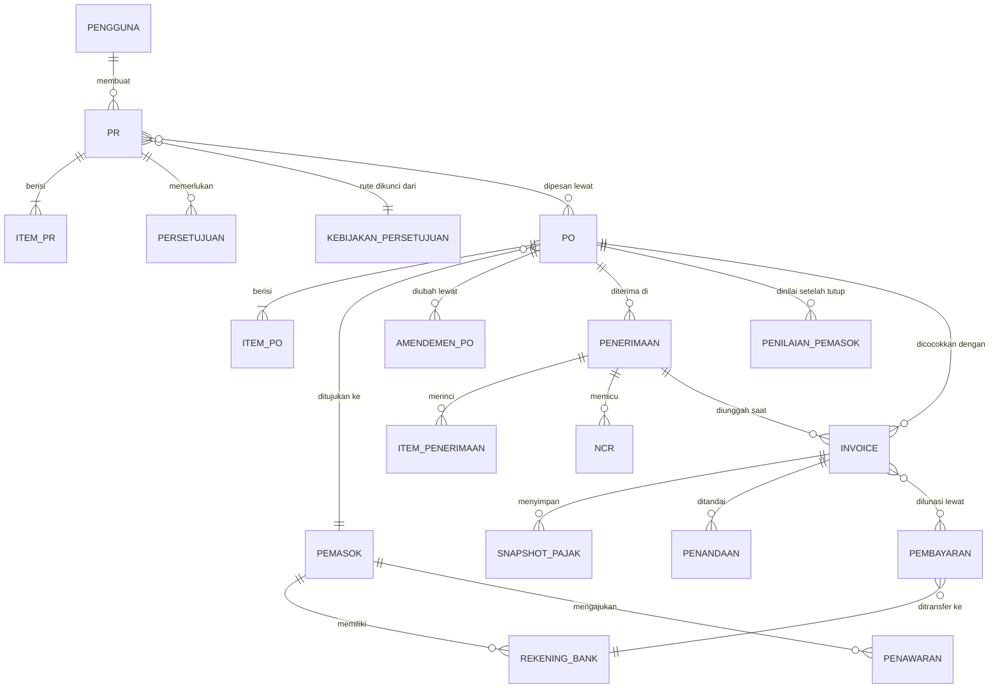

PRODUCT REQUIREMENTS DOCUMENT

# PRD: NusaProc — Nusanet Procurement System (Fase 1\)

Status: Draft   ·   Untuk: Product Management, Design, Product Owner   ·   Diperbarui: 23 Agustus 2026

## Daftar Isi

[1\. Header Dokumen](#1-header-dokumen)

[2\. Ringkasan](#2-ringkasan)

[3\. Masalah](#3-masalah)

[4\. Pengguna dan Use Case](#4-pengguna-dan-use-case)

[5\. Tujuan dan Metrik Sukses](#5-tujuan-dan-metrik-sukses)

[6\. Ruang Lingkup](#6-ruang-lingkup)

[7\. Kebutuhan (Requirements)](#7-kebutuhan-requirements)

[8\. Acceptance Criteria](#8-kriteria-diterima)

[9\. Dependencies dan Constraints](#9-dependencies-dan-constraints)

[10\. Asumsi dan Pertanyaan Terbuka](#10-asumsi-dan-pertanyaan-terbuka)

[11\. Release dan Rollout](#11-rencana-rilis)

## 1\. Header Dokumen

| Produk / Fitur | NusaProc — seluruh alur pengadaan, dari permintaan sampai pembayaran (Fase 1\) |
| :---- | :---- |
| Disusun oleh | Tim Product Management NusaProc |
| Status | Draft — *untuk ditinjau Product Management, Design, dan Product Owner* |
| Target release | Dipakai terbatas di production pada minggu ke-19–20 setelah gerbang M0 disahkan |
| Stakeholder | Product Management, Design, Engineering, Accounting (Account Payable), Finance, Pajak, Internal Audit, VP Finance |

Catatan cakupan: dokumen ini merangkum satu sistem utuh dengan 13 modul, sehingga lebih panjang dari PRD biasa. Banyak bagian sengaja disajikan sebagai tabel agar tetap mudah dibaca. Istilah teknis yang tidak bisa dihindari dijelaskan di Lampiran A — Kamus Istilah di halaman terakhir.

## 2\. Ringkasan

NusaProc adalah sistem pengadaan internal PT Media Antar Nusa (Nusanet). Hari ini urusan beli-membeli di Nusanet tersebar di chat, email, spreadsheet, dan dokumen kertas. NusaProc menggantikan semuanya dengan satu tempat resmi untuk mencatat perjalanan sebuah pembelian dari awal sampai uangnya keluar:

| Permintaan Pembelian (PR)  →  Persetujuan atasan  →  Cari dan pilih pemasok  →  Surat Pesanan (PO)  →  Barang/jasa diterima, sekaligus unggah invoice  →  Invoice dicocokkan dengan PO  →  Persetujuan bayar  →  Pembayaran  →  Pesanan ditutup dan pemasok dinilai |
| :---- |

Setiap langkah meninggalkan jejak: siapa melakukan apa, kapan, dan atas dasar apa. Data penting — nama pemasok, nomor rekening, tarif pajak, dan aturan persetujuan yang berlaku saat itu — disalin dan dikunci di setiap transaksi. Jadi kalau data induk diubah tahun depan, riwayat transaksi lama tidak ikut berubah dan tetap bisa dipertanggungjawabkan saat audit.

### 2.1 Diagram Relasi Entitas Utama

Diagram berikut menggambarkan hubungan antar entitas utama di NusaProc. Panah menunjukkan arah ketergantungan: entitas di ujung panah bergantung pada entitas di pangkalnya.

## 3\. Masalah

Ada beberapa hal yang membuat pengadaan Nusanet saat ini lebih berisiko:

1. **Tidak ada satu layar untuk melihat sebuah permintaan sudah sampai mana.** Untuk tahu status PR, PO, atau invoice, orang harus bertanya lewat chat dan menunggu jawaban.  
2. **Aturan persetujuan berbeda-beda antar divisi**. Tidak ada jaminan pembelian bernilai besar selalu naik ke atasan yang tepat.  
3. **Nomor rekening pemasok bisa diubah tanpa pemeriksaan berlapis**. Ini celah penipuan pembayaran yang paling umum: pembayaran benar, penerimanya yang salah.  
4. **Penerimaan barang/jasa tidak selalu didokumentasikan**, sehingga ada invoice yang dibayar tanpa bukti jelas bahwa barangnya memang sudah diterima.

**Dampaknya bagi perusahaan:** uang perusahaan berisiko keluar untuk hal yang tidak semestinya, dan perhitungan pajak (PPN/PPh) yang masih dikerjakan manual rawan salah — yang berujung pada koreksi, denda, dan temuan audit.

## 4\. Pengguna dan Use Case

### 4.1 Persona

Daftar berikut mengikuti model 7 peran yang disahkan VP Finance pada 29 Juli 2026 (DEC-032), ditambah satu persona pajak yang dijelaskan di catatan bawah tabel.

| Persona | Siapa mereka dan apa yang dikerjakan | Hal yang harus dicegah |
| :---- | :---- | :---- |
| Requester (Karyawan) | Staf dari divisi mana pun. Mengajukan permintaan pembelian, memantau progresnya, menerima atau menolak barang/jasa yang dia minta sendiri, membuat berita acara penerimaan, lalu mengunggah invoice dan dokumen pajak saat barang diterima. | PR diisi setengah-setengah; tanggal kebutuhan tidak realistis; tidak tahu sisa item yang belum dipesan; invoice yang sama diinput dua kali; kolom pajak salah isi; menerima barang lebih banyak dari yang dipesan. |
| Approver (Atasan) | Atasan langsung, misalnya Senior Manager. Menyetujui atau menolak PR sesuai jenjangnya. Sering mengerjakan ini dari ponsel di sela rapat. | Menyetujui tanpa membaca konteks; menyetujui permintaannya sendiri; menyetujui di luar wewenangnya atau melompati satu jenjang; menyetujui banyak dokumen sekaligus tanpa memeriksa. |
| Account Payable (Accounting) | Tim Accounting. Mencari dan membandingkan penawaran pemasok, membuat Surat Pesanan (PO), dan mengurus perubahan PO. Minimal dua orang per badan usaha atau divisi. | Menerbitkan PO ke pemasok atau rekening yang belum diverifikasi; menunjuk satu pemasok tanpa alasan tertulis; orang yang membuat PO juga yang menyetujuinya. |
| Warehouse (Gudang) | Staf gudang di cabang. Menerima atau menolak barang/jasa yang masuk lewat gudang, membuat berita acara penerimaan (BAST), dan mengunggah invoice. | Menerima lebih banyak dari isi PO; bukti penerimaan kurang; menandai barang "diterima" padahal belum; invoice ganda. |
| Finance | Tim Finance pusat. Mencocokkan invoice dengan PO, menangani invoice yang tertahan, menyiapkan dan menyetujui pembayaran, lalu merekonsiliasi dengan rekening koran. Tugas mengajukan, memeriksa, dan mengeksekusi pembayaran dipegang orang yang berbeda. | Invoice tertahan tidak terlihat siapa pun; transfer ke rekening yang salah; membayar dua kali untuk invoice yang sama; menembus tahanan tanpa alasan tercatat. |
| Finance — Pajak (Tax) | Staf pajak di bawah Finance. Memeriksa kebenaran PPN dan PPh pada setiap invoice, memastikan Nomor Seri Faktur Pajak (NSFP) valid dan dokumen pajaknya lengkap, membuat rekap PPN/PPh per masa pajak, dan mengunggah data ke Coretax secara manual. | Salah tarif atau salah jenis PPh; faktur pajak dengan nomor tidak valid atau kadaluarsa lolos; invoice tertahan lama tanpa alasan yang jelas bagi pemasok; angka rekap masa pajak tidak cocok dengan data transaksi di sistem. |
| Auditor (Eksternal) | Auditor dari luar perusahaan. Hanya boleh melihat dan mengunduh paket bukti; tidak punya wewenang mengubah apa pun. | Mengunduh data jauh melebihi kebutuhan; angka yang sama diartikan berbeda di laporan berbeda; tanpa sengaja mendapat akses mengubah data. |
| Admin | Tim IT/BIS. Mengelola akun, peran, data induk, kebijakan, dan calon pemasok. | Mengubah aturan pemisahan tugas atau nilai transaksi final tanpa jejak dan tanpa persetujuan orang kedua. |

| Catatan tentang persona Pajak. Keputusan DEC-032 menetapkan 7 peran di sistem, dan pemeriksaan pajak berada di dalam peran Finance. Persona "Finance — Pajak (Tax)" di atas adalah spesialisasi pekerjaan di dalam peran Finance, bukan peran kedelapan. Praktisnya: orang pajak login sebagai Finance, tetapi layar dan antrean kerjanya difokuskan pada pemeriksaan pajak. Kalau nanti diputuskan bahwa pajak butuh hak akses tersendiri — misalnya boleh menahan invoice karena alasan pajak tetapi tidak boleh menyentuh pembayaran — itu adalah perubahan atas DEC-032 dan perlu persetujuan tertulis VP Finance. Lihat pertanyaan terbuka Q4 di Bagian 10\. |
| :---- |

Satu orang boleh memegang lebih dari satu peran. Namun pada satu transaksi yang sama, sistem otomatis menolak kombinasi peran yang menimbulkan konflik kepentingan — misalnya orang yang membuat PO tidak bisa menjadi penyetujunya.

### 4.2 User Story

Ditulis dari sudut pandang orang yang memakai sistem, supaya jelas apa yang mereka butuhkan dan kenapa. Urutan tabel berikut berdasarkan prioritas (Must lebih dulu, lalu Should), bukan berdasarkan nomor ID.

| ID | Cerita pengguna | Prioritas |
| :---- | :---- | :---- |
| US1 | Sebagai requester, saya ingin membuat PR berisi daftar barang, perkiraan harga, dan cara bayarnya, supaya kebutuhan saya tercatat resmi dan langsung mengalir ke atasan yang tepat. | Must |
| US2 | Sebagai requester, kalau PR saya ditolak saya ingin riwayatnya tetap tersimpan dan saya bisa langsung membuat PR baru, supaya saya tidak bingung mencari tombol "revisi" yang memang tidak ada. | Must |
| US3 | Sebagai approver, saya ingin melihat alasan pengajuan, dokumen pendukung, dan sisa anggaran dalam satu layar sebelum menekan setuju, supaya keputusan saya bukan asal klik. | Must |
| US4 | Sebagai approver, saya ingin sistem menolak sendiri kalau saya mencoba menyetujui di luar wewenang saya, supaya saya tidak tanpa sadar melompati jenjang. | Must |
| US5 | Sebagai Account Payable, saya ingin sistem mencegah PO terbit selama pemasok dan rekeningnya belum diverifikasi, supaya saya tidak mengirim pesanan ke pihak yang belum diperiksa. | Must |
| US6 | Sebagai requester atau staf gudang, saya ingin mengunggah invoice di layar yang sama saat saya mencatat penerimaan barang, supaya tidak perlu menunggu proses terpisah di Finance. | Must |
| US7 | Sebagai Finance, saya ingin melihat hasil pencocokan invoice dengan PO beserta semua selisihnya dalam satu tempat, supaya saya tahu invoice mana yang sudah boleh dibayar. | Must |
| US8 | Sebagai Finance, saya ingin tugas mengajukan, memeriksa, dan mentransfer pembayaran dipisah ke tiga orang, supaya tidak ada satu orang yang bisa menyetujui sekaligus mencairkan uang. | Must |
| US9 | Sebagai requester, saya ingin menandai kebutuhan yang benar-benar mendesak agar disetujui lewat jalur cepat oleh orang lain, bukan oleh diri saya sendiri, supaya prosesnya cepat tanpa kehilangan pertanggungjawaban. | Must |
| US10 | Sebagai pemilik proses (Finance/Internal Audit), saya ingin setiap pengadaan darurat otomatis masuk daftar tinjauan setelah kejadian, supaya jalur cepat tidak berubah jadi kebiasaan. | Must |
| US11 | Sebagai auditor eksternal, saya ingin mengunduh berkas bukti lengkap satu transaksi dalam hitungan menit tanpa bisa mengubah apa pun, supaya persiapan audit tidak lagi memakan berhari-hari. | Must |
| US12 | Sebagai admin, saya ingin mengelola akun, peran, dan aturan pemisahan tugas dengan persetujuan orang kedua, supaya tidak ada satu orang yang bisa melonggarkan kontrol sendirian. | Must |
| US15 | Sebagai petugas pajak, saya ingin satu daftar berisi semua invoice yang menunggu pemeriksaan pajak beserta apa yang kurang dari masing-masing, supaya saya tidak perlu membuka invoice satu per satu untuk mencarinya. | Must |
| US16 | Sebagai petugas pajak, saya ingin rekap PPN dan PPh per masa pajak yang bisa langsung diunduh dan ditelusuri kembali ke invoice aslinya, supaya penyiapan pelaporan pajak tidak lagi dikerjakan manual di spreadsheet. | Must |
| US13 | Sebagai staf gudang atau Account Payable, saya ingin menilai kinerja pemasok setelah pesanan ditutup, supaya kualitas pemasok terpantau dari waktu ke waktu. | Should |
| US14 | Sebagai pengguna yang memegang beberapa peran, saya ingin menyaring tampilan sesuai peran yang sedang saya kerjakan tanpa mengubah hak akses saya, supaya layar tidak penuh hal yang tidak relevan. | Should |

# 

## 5\. Tujuan dan Metrik Sukses

### 5.1 Yang ingin dicapai

* NusaProc menjadi satu-satunya tempat resmi mencatat pengadaan Nusanet — tidak ada lagi pembelian yang hanya hidup di chat atau spreadsheet.

* Kontrol keuangan berjalan otomatis dari sistem — kewajaran belanja, verifikasi rekening, dan pemisahan tugas — bukan bergantung pada kedisiplinan orang per orang.

* Perhitungan pajak (PPN/PPh) dan penyimpanan bukti pajaknya akurat dan bisa ditelusuri per transaksi.

* Waktu menyiapkan bukti untuk auditor turun dari berhari-hari menjadi hitungan menit.

### 5.2 Yang bukan tujuan sistem ini

* Bukan penentu keabsahan pajak. Sistem menyediakan kontrol dan bukti; keputusan soal benar-tidaknya perlakuan pajak tetap ada di Finance dan tim Pajak.

* Bukan pengganti pertimbangan manusia. Sistem menegakkan proses yang sudah diputuskan; sistem tidak memutuskan pemasok mana yang paling baik untuk perusahaan.

* Bukan integrasi penuh ke sistem akuntansi/ERP. Fase 1 hanya menyediakan jalur API/webhook; pembuatan jurnal otomatis di luar cakupan.

* Bukan bukti sertifikasi ISO. Pemetaan ke ISO 9001 dan ISO/IEC 27001 membantu persiapan, tetapi tidak sama dengan sertifikat.

### 5.3 Ukuran keberhasilan

Tujuh angka berikut dipakai untuk menilai apakah NusaProc berhasil. Semuanya sengaja dibuat sederhana: satu kalimat tentang apa yang diukur, dan langkah nyata untuk mengukurnya.

| Kode | Apa yang kita ukur | Target | Cara mengukurnya |
| :---- | :---- | :---- | :---- |
| G-01 | Semua pembelian resmi benar-benar lewat NusaProc, bukan lewat chat atau email. | 100% dalam 3 bulan sejak dipakai | Ambil daftar seluruh pembelian yang terjadi bulan itu (termasuk yang masuk lewat jalur lama). Hitung berapa yang punya PR di NusaProc. Bagi, lalu jadikan persen. |
| G-03 | Invoice yang bermasalah makin sedikit. "Bermasalah" berarti dokumennya kurang, data pajaknya tidak lengkap, atau nilainya beda dari PO di luar batas wajar. | Kurang dari 10 dari setiap 100 invoice, mulai bulan ke-4 | Setiap akhir bulan, hitung berapa invoice yang masuk dan berapa di antaranya yang sempat tertahan. Bagi, lalu jadikan persen. |
| G-04 | Invoice dari pemasok yang berstatus PKP selalu disertai dokumen pajak yang lengkap dan nomor faktur yang valid. | Minimal 99 dari setiap 100 invoice PKP | Dari daftar invoice pemasok PKP bulan itu, hitung berapa yang faktur pajaknya terunggah dan nomor NSFP-nya lolos pemeriksaan sistem. |
| G-05 | Tidak ada uang yang keluar dua kali atau masuk ke rekening yang salah. | Nol kejadian yang berdampak material | Buka catatan pembayaran bermasalah di sistem setiap bulan dan hitung berapa kejadian pembayaran ganda atau salah rekening yang tercatat. |
| G-06 | Setiap pesanan yang selesai diikuti penilaian terhadap pemasoknya. | Minimal 9 dari setiap 10 pesanan yang ditutup | Dari daftar PO yang ditutup bulan itu, hitung berapa yang formulir penilaian pemasoknya sudah terisi. |
| G-07 | Menyiapkan bukti satu transaksi untuk auditor cukup hitungan menit. | Kurang dari 10 menit per transaksi | Minta auditor (atau tim internal) memilih satu transaksi acak. Catat waktu dari saat diminta sampai berkas buktinya siap diunduh. Ulangi beberapa kali, ambil rata-ratanya. |
| G-08 | Karyawan benar-benar memakai sistem, bukan sekadar punya akun. | Minimal 9 dari setiap 10 pengguna, pada bulan ke-2 | Dari daftar requester dan approver yang punya akun, hitung berapa yang bulan itu login dan menyelesaikan minimal satu tugas (membuat PR atau memberi keputusan approval). |

Titik awal (baseline). Kecuali G-06, angka awal semua metrik di atas belum pernah diukur karena datanya memang belum terkumpul. Semuanya diukur satu kali di gerbang M0 sebagai titik awal pembanding. Untuk G-06 titik awalnya 0%, karena penilaian pemasok saat ini belum dilakukan secara terstruktur.

Catatan G-02. Metrik lama G-02 (mempercepat waktu dari persetujuan PR sampai PO terbit) dihapus pada Revisi 2 dan bukan lagi target resmi. Penomoran G-01, G-03 … G-08 sengaja dipertahankan agar rujukan di dokumen lain tidak ikut bergeser.

## 6\. Ruang Lingkup

### 6.1 Yang dikerjakan di Fase 1

* Pengelolaan pengguna dengan 7 peran, termasuk pendelegasian sementara kalau atasan sedang cuti.

* PR berisi banyak item, lengkap dengan penanda cara bayar (bayar dimuka/COD atau bayar setelah terima).

* Persetujuan berjenjang yang ditentukan otomatis dari nilai, divisi, dan kategori belanja.

* Daftar pemasok yang disetujui (AVL) dan verifikasi rekening bank pemasok.

* Pencatatan penawaran harga dan perbandingan antar pemasok.

* Surat Pesanan (PO) yang bisa dibuat dari satu atau beberapa PR sekaligus.

* Penerimaan barang/jasa dengan berita acara (BAST), termasuk penerimaan sebagian.

* Unggah invoice atau tanda terima di langkah penerimaan itu juga.

* Pencocokan dua arah antara invoice dan PO, dengan penandaan otomatis kalau ada selisih.

* Proses pembayaran dengan tiga orang berbeda: yang mengajukan, yang memeriksa, dan yang mentransfer.

* Jalur pengadaan darurat, lengkap dengan tinjauan wajib setelah kejadian.

* Dashboard per peran, notifikasi email dan dalam aplikasi.

* Jejak audit yang tidak bisa dihapus, disimpan minimal 10 tahun.

* Impor dan ekspor data induk.

### 6.2 Yang belum dikerjakan di Fase 1

| Tidak termasuk | Alasan |
| :---- | :---- |
| Sambungan otomatis ke Coretax/DJP | Untuk sekarang, petugas pajak mengunggah datanya sendiri. Sambungan otomatis menyusul di rilis berikutnya. |
| Pembuatan jurnal otomatis ke sistem akuntansi/ERP | Fase 1 hanya menyediakan jalur API/webhook agar sistem lain bisa mengambil datanya. |
| e-tender, e-auction, dan portal khusus pemasok | Belum dibutuhkan di fase ini; pemasok masih berkomunikasi lewat jalur biasa. |
| Pencatatan stok gudang berjalan (perpetual inventory) | Bukan bagian inti dari proses pengadaan. |
| Penyelesaian transaksi multi mata uang | Kolomnya sudah disiapkan di database, tetapi tampilan fase 1 hanya menangani Rupiah. |
| Aplikasi ponsel yang dipasang dari app store | Situs yang menyesuaikan layar ponsel dinilai sudah cukup untuk kebutuhan approval di jalan. |
| Pencocokan tiga atau empat arah | Kebijakan yang disahkan adalah pencocokan dua arah (invoice dengan PO). Bukti penerimaan tetap wajib, tetapi diperlakukan sebagai kontrol terpisah. |

## 7\. Kebutuhan (Requirements)

Enam puluh lima kebutuhan berikut dikelompokkan per bagian sistem. "Must" berarti wajib ada di Fase 1; "Should" berarti sangat diharapkan tetapi bisa digeser kalau waktu mepet.

### 7.1 Akun dan Hak Akses

| ID | Kebutuhan | Prioritas |
| :---- | :---- | :---- |
| R1 | Pengguna masuk memakai akun Google Workspace perusahaan. Akun lokal hanya disediakan sebagai jalur darurat kalau Google sedang bermasalah, dan wajib memakai verifikasi dua langkah. | Must |
| R2 | Sistem mengenal 7 peran: requester, approver, account payable, warehouse, finance, auditor, dan admin. Satu orang boleh punya beberapa peran, tetapi sistem tetap memeriksa konflik kepentingan di setiap dokumen. | Must |
| R3 | Admin bisa mengaktifkan dan menonaktifkan akun serta peran dengan tanggal berlaku, tanpa menghapus riwayat orang tersebut. | Must |
| R4 | Atasan yang berhalangan bisa mendelegasikan wewenang persetujuannya, dengan batas tanggal dan batas cakupan yang jelas. | Must |
| R5 | Untuk tindakan berisiko tinggi — mengubah rekening pemasok, menyetujui pembayaran, mengekspor data sensitif — sistem meminta pengguna memasukkan ulang kredensialnya meskipun sudah login. | Must |

### 7.2 Permintaan Pembelian (PR)

| ID | Kebutuhan | Prioritas |
| :---- | :---- | :---- |
| R6 | Requester membuat PR berisi beberapa item sekaligus, dilengkapi pusat biaya, alasan kebutuhan, tanggal dibutuhkan, perkiraan harga, dan dokumen pendukung. | Must |
| R7 | Saat membuat PR, requester wajib memilih cara bayarnya: "Bayar Dimuka/COD" atau "Bayar Setelah Terima". Pilihan ini yang menentukan apakah PR masuk jalur biasa atau jalur uang muka. | Must |
| R8 | Draft PR tersimpan otomatis dan diberi nomor versi. Requester bisa membatalkan PR selama belum ada persetujuan final. | Must |
| R9 | PR tidak punya jalur revisi. PR yang tidak sesuai hanya bisa berakhir ditolak (oleh atasan) atau dibatalkan (oleh requester); riwayat dan alasannya tetap tersimpan lengkap, lalu requester membuat PR baru. | Must |
| R10 | Sistem menampilkan sisa item PR — berapa yang diminta, disetujui, sudah dipesan, dan belum dipesan — agar requester tahu posisinya tanpa bertanya. | Must |
| R11 | PR boleh dipesan sebagian, dan sisanya bisa ditutup dengan alasan yang tercatat. | Must |

### 7.3 Alur Persetujuan

| ID | Kebutuhan | Prioritas |
| :---- | :---- | :---- |
| R12 | Rute persetujuan ditentukan otomatis dari nilai, divisi, kategori, dan penanda risiko, lalu dikunci pada saat PR dikirim sehingga tidak berubah di tengah jalan. | Must |
| R13 | Approver hanya bisa menyetujui dokumen dalam jenjangnya sendiri dan tidak bisa melompati level. Contohnya, PR dari Area Manager hanya bisa disetujui Senior Manager langsung di atasnya. | Must |
| R14 | Menolak wajib disertai alasan. Setiap keputusan persetujuan disimpan permanen: siapa, kapan, dan aturan versi mana yang berlaku saat itu. | Must |
| R15 | Menyetujui pengajuan sendiri dan pelanggaran pemisahan tugas ditolak otomatis oleh sistem — tidak bergantung pada kedisiplinan orang. | Must |
| R16 | Kalau isi dokumen berubah secara material setelah disetujui, persetujuan harus diulang. | Must |

### 7.4 Pemasok, Rekening, dan Pencarian Penawaran

| ID | Kebutuhan | Prioritas |
| :---- | :---- | :---- |
| R17 | Pemasok baru selalu berstatus "calon" dulu. PO tidak bisa terbit sebelum pemasok berstatus disetujui, dan persetujuan itu perlu dua orang berbeda. | Must |
| R18 | Rekening bank pemasok disimpan terpisah dari profilnya, ditampilkan tersamar, dan harus diverifikasi lewat jalur independen oleh dua orang sebelum bisa dipakai membayar. | Must |
| R19 | Perubahan rekening pemasok tidak menimpa rekening lama. Sistem membuat rekening baru berstatus menunggu verifikasi; rekening lama tetap aktif sampai verifikasi selesai, dan perubahan itu langsung memicu peringatan ke Account Payable dan Finance. | Must |
| R20 | Account Payable mencatat cara pengadaan dan minimal satu dokumen penawaran. Di atas nilai tertentu, jumlah penawaran minimum mengikuti kebijakan; kalau kurang, wajib ada alasan tertulis untuk penunjukan langsung atau kondisi darurat. | Must |
| R21 | Sistem menampilkan perbandingan sederhana antar penawaran — harga, waktu pengiriman, dan kesesuaian spesifikasi — sebagai dasar keputusan Account Payable. | Should |
| R22 | Warehouse atau Account Payable menilai kinerja pemasok setelah pesanan ditutup. | Should |

### 7.5 Surat Pesanan (PO)

| ID | Kebutuhan | Prioritas |
| :---- | :---- | :---- |
| R23 | PO bisa dibuat dari satu atau beberapa PR, dan setiap baris PO tetap terhubung ke baris PR asalnya. | Must |
| R24 | Tombol terbitkan PO tetap nonaktif sampai semua pemeriksaan wajib lolos: pemasok sudah disetujui, rekening sudah diverifikasi, PR sudah disetujui, dan tidak ada konflik kepentingan. Setiap penghalang ditampilkan beserta tautan cara memperbaikinya. | Must |
| R25 | Orang yang membuat PO tidak boleh menyetujui PO yang sama. Karena itu peran Account Payable wajib diisi minimal dua orang berbeda di tiap badan usaha atau divisi. | Must |
| R26 | PO yang sudah terbit tidak bisa diubah langsung. Perubahan hanya lewat amendemen bernomor, dengan persetujuan ulang sesuai besarnya perubahan. | Must |
| R27 | PO menghasilkan PDF resmi berisi nomor versi, ringkasan siapa saja yang menyetujui, syarat dan ketentuan, serta kriteria penerimaan. | Must |

### 7.6 Penerimaan Barang/Jasa dan Laporan Ketidaksesuaian

| ID | Kebutuhan | Prioritas |
| :---- | :---- | :---- |
| R28 | Penerimaan dicatat oleh requester (untuk jasa dan pembelian langsung) atau oleh Warehouse (untuk barang yang masuk lewat gudang), baik penuh maupun sebagian, beserta hasil pemeriksaan atau berita acara. | Must |
| R29 | Di langkah penerimaan yang sama, requester atau Warehouse mengunggah invoice atau tanda terima, yang langsung terhubung ke PO-nya — tidak perlu menunggu pemasok mengirimkannya ke Finance. | Must |
| R30 | Kalau ada kekurangan atau kerusakan saat penerimaan, sistem otomatis membuat Laporan Ketidaksesuaian (NCR). Selama NCR belum selesai, invoice dan penutupan PO bisa ditahan sesuai kebijakan. | Must |
| R31 | Orang yang menerima barang tidak boleh menjadi pembuat maupun penyetuju PO pada transaksi yang sama. Ini kontrol pengimbang atas kebijakan requester boleh menerima barangnya sendiri. | Must |
| R32 | Seluruh penerimaan dan invoice yang diinput requester atau Warehouse tercatat penuh di jejak audit. | Must |

### 7.7 Invoice, Pajak, dan Pencocokan

| ID | Kebutuhan | Prioritas |
| :---- | :---- | :---- |
| R33 | Sistem menangani berbagai jenis invoice: biasa, uang muka, termin, final, nota kredit, dan nota debit. Satu invoice bisa dialokasikan ke satu atau beberapa PO. | Must |
| R34 | Sistem mendeteksi invoice ganda dengan membandingkan nomor invoice pemasok (setelah diseragamkan penulisannya), tanggal, nilai, dan nomor faktur pajak. | Must |
| R35 | Nomor Seri Faktur Pajak (NSFP) didukung dalam format lama 16 digit maupun format Coretax 17 digit, dan disimpan dalam bentuk asli sekaligus bentuk yang sudah diseragamkan. | Must |
| R36 | Setiap invoice menyimpan salinan aturan pajak yang berlaku saat itu: tarif PPN, faktor dasar pengenaan pajak, dan PPh yang dipotong atau dipungut (Pasal 21/22/23/4(2)). Jadi kalau peraturan berubah tahun depan, riwayat transaksi lama tetap seperti apa adanya. | Must |
| R37 | Pencocokan dilakukan dua arah: invoice dengan PO. Bukti penerimaan tetap wajib, tetapi diperlakukan sebagai kontrol terpisah, bukan bagian dari pencocokan. | Must |
| R38 | Selisih di luar batas wajar memunculkan penandaan beserta alasannya. Invoice yang penandaannya belum selesai tidak bisa masuk antrean pembayaran. Batas wajar dikonfigurasi admin per kategori belanja, dengan nilai bawaan: ≤ 1% dari nilai PO atau ≤ Rp 100.000 (mana yang lebih besar). Selisih di bawah batas wajar tetap dicatat tetapi tidak menahan pembayaran. | Must |
| R39 | Penandaan hanya bisa dilepas oleh peran yang ditetapkan (Head of Account Payable untuk selisih di atas ambang tertentu), wajib disertai alasan dan bukti, dan ditinjau Finance setiap minggu. | Must |
| R40 | Koreksi atas invoice atau dokumen yang sudah final selalu lewat amendemen, pembalikan, atau nota kredit/debit — tidak pernah dengan mengedit langsung. | Must |

### 7.8 Pembayaran

| ID | Kebutuhan | Prioritas |
| :---- | :---- | :---- |
| R41 | Antrean pembayaran hanya berisi invoice yang lolos pencocokan dan disetujui Finance, atau permintaan uang muka yang disetujui sesuai penanda cara bayar di PR. | Must |
| R42 | Usulan pembayaran disusun dari invoice yang sudah lolos pencocokan dan sudah memperhitungkan PPh yang dipotong. Yang mengusulkan, yang memeriksa, dan yang mentransfer wajib tiga orang berbeda pada transaksi yang sama. | Must |
| R43 | Sebelum transfer dieksekusi, sistem meminta pengguna memasukkan ulang kredensialnya. Sistem juga menandai setiap perintah bayar dengan kode unik, sehingga klik ganda atau koneksi putus tetap menghasilkan satu transaksi — bukan dua. | Must |
| R44 | Nilai yang sudah terbayar dihitung dari alokasi pembayaran ke invoice beserta bukti transfernya. Angka "sisa yang belum dibayar" adalah hasil hitungan sistem, bukan status yang bisa diketik orang. | Must |
| R45 | Pembatalan atau pengembalian pembayaran hanya lewat pembalikan atau pembatalan yang teraudit — record aslinya tidak pernah dihapus. | Must |
| R46 | Beberapa pembayaran boleh digabung dalam satu perintah transfer, tetapi hanya untuk pemasok yang sama. | Should |
| R47 | Jalur uang muka didukung penuh sebagai fitur standar: pembayaran boleh dilakukan sebelum barang diterima, sepanjang PO memang memuat termin uang muka, ada dokumen dasarnya (proforma atau invoice uang muka), dan persetujuan khususnya terpenuhi. Uang muka tidak pernah dianggap sebagai bukti bahwa barang sudah diterima. | Must |

### 7.9 Pengadaan Darurat

| ID | Kebutuhan | Prioritas |
| :---- | :---- | :---- |
| R48 | Requester bisa menandai PR sebagai pengadaan darurat. PR darurat disetujui oleh approver khusus yang berbeda dari pembuatnya, dan boleh memakai satu pemasok saja. | Must |
| R49 | Setiap PR darurat otomatis masuk antrean Tinjauan Pasca-Darurat berisi nomor PO, nilai, alasan daruratnya, siapa yang menyetujui saat itu, tenggat tinjauan, dan status tinjauannya. | Must |
| R50 | Pengadaan darurat dan penunjukan langsung wajib disertai alasan tertulis, dan penyetujunya harus berbeda dari pembuatnya. | Must |

### 7.10 Dokumen, Notifikasi, dan Jejak Audit

| ID | Kebutuhan | Prioritas |
| :---- | :---- | :---- |
| R51 | Setiap lampiran diperiksa dulu — jenis file, ukuran, pemindaian virus, dan pencocokan sidik digital — sebelum boleh dipakai sebagai bukti final. File yang belum selesai diperiksa ditandai "sedang diperiksa". | Must |
| R52 | Bukti yang sudah final tidak bisa dihapus dari aplikasi oleh siapa pun. | Must |
| R53 | Jejak audit hanya bisa ditambah, tidak pernah diubah atau dihapus. Yang dicatat: pembuatan, perubahan, perubahan status, persetujuan, akses, ekspor, perubahan hak akses, dan perubahan konfigurasi — lengkap dengan nilai sebelum/sesudah, alasan, pelaku, dan waktu. | Must |
| R54 | Auditor eksternal bisa membaca seluruh data dan mengunduh paket bukti lengkap, tanpa wewenang mengubah transaksi apa pun. | Must |
| R55 | Notifikasi email dan dalam aplikasi dikirim untuk pengingat persetujuan, tanggal jatuh tempo, dokumen pemasok yang akan kedaluwarsa, serta keterlambatan penerimaan, invoice, dan pembayaran — lengkap dengan status pengiriman dan pengiriman ulang kalau gagal. | Must |

### 7.11 Laporan dan Administrasi

| ID | Kebutuhan | Prioritas |
| :---- | :---- | :---- |
| R56 | Dashboard disesuaikan per peran dan berisi daftar hal yang perlu dikerjakan beserta lamanya menunggu — bukan grafik hiasan. | Must |
| R57 | Istilah nilai (diminta, dipesan, diterima, ditagih, terutang, terbayar, sisa) punya arti yang persis sama di seluruh laporan. | Must |
| R58 | Tersedia laporan siap ekspor untuk: rekap PPN/PPh per masa pajak, kinerja pemasok, invoice bermasalah, pelanggaran pemisahan tugas, perubahan rekening pemasok, penunjukan langsung, dan pengadaan darurat. | Must |
| R59 | Ekspor data besar diproses di belakang layar dan hasilnya diambil lewat tautan yang kedaluwarsa dalam waktu tertentu. Semua kegiatan ekspor tercatat. | Must |
| R60 | Admin mengelola data induk, kebijakan persetujuan/pajak/pencocokan, dan calon pemasok. Perubahan konfigurasi yang material perlu persetujuan orang kedua. | Must |

### 7.12 Integrasi dan Penanganan Khusus

| ID | Kebutuhan | Prioritas |
| :---- | :---- | :---- |
| R61 | Sistem menyediakan API berbasis REST dan webhook untuk setiap peristiwa utama (PR disetujui, PO terbit, invoice cocok, pembayaran selesai). API menggunakan autentikasi token, rate limiting, dan pencatatan akses. Dokumentasi API tersedia untuk tim engineering sistem lain. | Must |
| R62 | Kalau delegasi berakhir (tanggal habis atau pendelegasi kembali aktif), dokumen yang sedang dalam antrean approval delegat tetap di antreannya sampai selesai, tetapi dokumen baru kembali ke pendelegasi asli. | Must |
| R63 | Kalau satu-satunya approver pada suatu jenjang tidak tersedia dan tidak mendelegasikan wewenangnya dalam waktu yang ditentukan kebijakan, sistem mengirim eskalasi otomatis ke atasan satu tingkat di atas jenjang tersebut, lengkap dengan pemberitahuan ke admin. | Must |
| R64 | Kalau delegat meninggalkan perusahaan atau akunnya dinonaktifkan saat masih memegang delegasi, delegasi otomatis dibatalkan dan dokumen yang belum diputuskan dikembalikan ke pendelegasi asli atau dieskalasi ke atasannya. Kejadian ini dicatat di jejak audit dan admin mendapat peringatan. | Must |
| R65 | Kalau pemasok di-nonaktifkan atau di-blacklist setelah PO sudah terbit tetapi barang belum diterima seluruhnya, PO tersebut ditandai dengan peringatan khusus. Penerimaan barang yang sudah dalam perjalanan tetap bisa dicatat, tetapi PO tidak bisa diperpanjang atau diamendemen untuk menambah item baru. | Should |

### 7.13 Kebutuhan Non-Fungsional

Bagian ini soal mutu sistem, bukan fitur: seberapa cepat, seberapa andal, seberapa aman.

| Aspek | Yang diharapkan |
| :---- | :---- |
| Kecepatan | Membuka daftar atau detail dokumen tuntas di bawah 2 detik untuk 95 dari 100 percobaan. Mencari di antara 100 ribu invoice di bawah 3 detik. Ekspor data besar diproses di belakang layar supaya tidak membuat layar menggantung. |
| Keandalan | Sistem tersedia minimal 99,5% dalam sebulan (setara paling banyak sekitar 3,5 jam gangguan). Kalau terjadi bencana, data yang hilang maksimal 4 jam terakhir dan sistem kembali jalan dalam maksimal 4 jam. |
| Keamanan | Masuk lewat akun perusahaan, dengan verifikasi dua langkah untuk peran sensitif. Pengamanan aplikasi mengikuti baseline OWASP ASVS Level 2 — daftar periksa keamanan aplikasi yang lazim dipakai industri. |
| Kemudahan akses | Alur utama memenuhi standar aksesibilitas WCAG 2.2 AA: bisa dioperasikan hanya dengan keyboard, semua isian punya label, warna cukup kontras, dan pesan kesalahan dirangkum jelas di atas form. |
| Perangkat dan browser | Berjalan di dua versi terbaru Chrome, Edge, dan Firefox. Tampilan menyesuaikan layar sampai selebar 360 piksel, sehingga approval bisa dikerjakan dari ponsel. |
| Bahasa dan format | Bahasa Indonesia sebagai bahasa utama. Format tanggal dan mata uang konsisten. Tampilan memakai waktu Asia/Jakarta, sementara di database waktu disimpan dalam UTC agar tidak bergeser. |
| Penyimpanan data | Bukti transaksi disimpan minimal 10 tahun di wilayah Indonesia. Kalau ada penahanan untuk keperluan hukum, dokumen itu tidak ikut terhapus meskipun jadwal pemusnahannya sudah lewat. |

## 8\. Kriteria Diterima

Bagian ini menjabarkan kebutuhan paling kritis menjadi skenario konkret, supaya tim QA dan desainer punya patokan yang sama tentang arti "sudah benar". Formatnya: kondisi awal → yang dilakukan → yang harus terjadi.

### R7 — Cara bayar wajib dipilih di PR

| Kondisi awal | Yang dilakukan | Yang harus terjadi |
| :---- | :---- | :---- |
| Requester sedang mengisi form PR. | Ia sampai ke bagian cara bayar. | Sistem mewajibkan ia memilih "Bayar Dimuka/COD" atau "Bayar Setelah Terima" sebelum PR bisa dikirim. |
| PR ditandai "Bayar Dimuka/COD". | PR disetujui dan PO dibuat. | PO menampilkan termin uang muka dan mengarah ke jalur persetujuan uang muka yang sesuai. |

### R9 — PR tidak punya jalur revisi

| Kondisi awal | Yang dilakukan | Yang harus terjadi |
| :---- | :---- | :---- |
| Approver menolak sebuah PR. | Requester membuka PR tersebut. | Satu-satunya aksi yang tersedia adalah membuat PR baru. Tidak ada tombol "Revisi" atau "Ajukan ulang". |
| PR sudah ditolak atau dibatalkan. | Siapa pun membuka riwayat PR itu. | Alasan penolakan atau pembatalan dan seluruh data aslinya tetap terlihat lengkap. |

### R13 — Persetujuan tidak boleh melompati jenjang

| Kondisi awal | Yang dilakukan | Yang harus terjadi |
| :---- | :---- | :---- |
| Seorang Area Manager mencoba menyetujui PR yang seharusnya ditangani Senior Manager. | Ia membuka PR tersebut. | PR itu tidak muncul di antrean approval-nya dan tombol setuju tidak tersedia. |
| Aturan persetujuan diubah setelah PR dikirim. | Approver membuka PR tersebut. | Yang berlaku adalah aturan yang dikunci saat PR dikirim, bukan aturan terbaru. |

### R24 — PO tidak terbit sebelum semua pemeriksaan lolos

| Kondisi awal | Yang dilakukan | Yang harus terjadi |
| :---- | :---- | :---- |
| Pemasok pada PO masih berstatus calon, atau rekeningnya belum diverifikasi. | Account Payable menekan "Terbitkan PO". | Tombol nonaktif dan sistem menampilkan daftar penghalang, masing-masing dengan tautan cara memperbaikinya. |
| Seluruh pemeriksaan sudah lolos. | Account Payable menerbitkan PO. | Nomor PO diberikan otomatis dan PDF resmi berisi ringkasan persetujuan langsung dihasilkan. |

### R25 — Minimal dua orang di peran Account Payable

| Kondisi awal | Yang dilakukan | Yang harus terjadi |
| :---- | :---- | :---- |
| Seorang Account Payable membuat PO. | Orang yang sama mencoba menyetujuinya. | Sistem menolak, karena itu sama dengan menyetujui pekerjaan sendiri. |
| Di suatu divisi hanya ada satu orang aktif dengan peran Account Payable. | Admin membuka laporan pemisahan tugas. | Divisi itu ditandai sebagai pelanggaran kontrol minimal dua orang yang perlu ditindaklanjuti. |

### R29 — Invoice diunggah saat penerimaan

| Kondisi awal | Yang dilakukan | Yang harus terjadi |
| :---- | :---- | :---- |
| Requester atau staf gudang sedang mencatat penerimaan barang. | Mereka menyelesaikan langkah berita acara penerimaan. | Di form yang sama tersedia unggah invoice atau tanda terima, sebelum penerimaan dianggap selesai. |
| Invoice sudah diunggah saat penerimaan. | Finance membuka invoice tersebut. | Invoice sudah otomatis terhubung ke PO-nya, tanpa perlu diinput ulang. |

### R34 — Deteksi invoice ganda

| Kondisi awal | Yang dilakukan | Yang harus terjadi |
| :---- | :---- | :---- |
| Invoice dengan nomor, tanggal, dan nilai yang sama pernah dicatat sebelumnya. | Requester atau staf gudang mengetikkan nomor invoice baru. | Sistem langsung menampilkan peringatan "kemungkinan invoice ganda" beserta dokumen pembandingnya, sebelum invoice bisa disimpan. |

### R37 & R38 — Pencocokan dua arah dan penandaan selisih

| Kondisi awal | Yang dilakukan | Yang harus terjadi |
| :---- | :---- | :---- |
| Nilai invoice sama dengan nilai PO, masih dalam batas wajar. | Finance membuka invoice tersebut. | Hasil pencocokan menunjukkan "cocok" dan invoice boleh masuk antrean pembayaran. |
| Nilai invoice berbeda dari PO di luar batas wajar. | Sistem menjalankan pencocokan. | Invoice ditandai bermasalah beserta alasannya, dan tidak muncul di antrean pembayaran sampai selisihnya diselesaikan atau disetujui secara tertulis. |

### R42 — Tiga orang berbeda untuk satu pembayaran

| Kondisi awal | Yang dilakukan | Yang harus terjadi |
| :---- | :---- | :---- |
| Seorang staf Finance membuat usulan pembayaran. | Orang yang sama mencoba memeriksanya. | Sistem menolak aksi tersebut. |
| Usulan pembayaran sudah lolos pemeriksaan. | Pelaksana mengeksekusi transfernya. | Pelaksana harus berbeda dari pengusul dan pemeriksa, dan sistem meminta kredensial dimasukkan ulang sebelum transfer diselesaikan. |

### R43 — Klik ganda tidak menghasilkan pembayaran ganda

| Kondisi awal | Yang dilakukan | Yang harus terjadi |
| :---- | :---- | :---- |
| Pelaksana menekan "Eksekusi Pembayaran" lalu koneksinya terputus. | Ia menekan tombol yang sama sekali lagi. | Sistem menampilkan hasil transaksi yang sama persis, bukan membuat pembayaran kedua. |

### R48 & R49 — Pengadaan darurat dan tinjauan setelahnya

| Kondisi awal | Yang dilakukan | Yang harus terjadi |
| :---- | :---- | :---- |
| Requester menandai PR sebagai darurat. | PR dikirim. | Sistem mengarahkannya ke approver khusus darurat, bukan approver biasa, dan meminta alasan tertulis. |
| PO darurat sudah diterbitkan. | PO tersebut tersimpan. | Satu entri otomatis muncul di antrean Tinjauan Pasca-Darurat dengan status "Belum ditinjau" dan tenggat tinjauannya. |

### R54 — Auditor hanya bisa melihat

| Kondisi awal | Yang dilakukan | Yang harus terjadi |
| :---- | :---- | :---- |
| Seorang auditor eksternal masuk ke sistem. | Ia membuka transaksi mana pun. | Semua tombol ubah, hapus, dan setujui tersembunyi atau nonaktif. Yang tersedia hanya "Lihat" dan "Unduh bukti". |
| Auditor meminta satu transaksi contoh secara lengkap. | Paket bukti dihasilkan. | Seluruh dokumen, persetujuan, dan jejak auditnya terkumpul dalam satu unduhan, dalam waktu kurang dari 10 menit. |

### US15 & US16 — Pemeriksaan pajak

| Kondisi awal | Yang dilakukan | Yang harus terjadi |
| :---- | :---- | :---- |
| Beberapa invoice tertahan karena dokumen pajaknya kurang atau nomor fakturnya tidak valid. | Petugas pajak membuka antrean pemeriksaan pajak. | Seluruh invoice itu tampil dalam satu daftar, masing-masing menyebutkan apa yang kurang, tanpa perlu dibuka satu per satu. |
| Satu masa pajak sudah berakhir. | Petugas pajak membuka rekap PPN/PPh masa tersebut. | Rekap bisa diunduh, dan setiap angka di dalamnya bisa diklik untuk menelusuri invoice asal yang membentuknya. |

### R15 — Menyetujui pengajuan sendiri dan pelanggaran pemisahan tugas ditolak otomatis

| Kondisi awal | Yang dilakukan | Yang harus terjadi |
| :---- | :---- | :---- |
| Seorang requester juga punya peran approver. | Ia membuat PR lalu mencoba menyetujuinya sendiri. | Sistem menolak aksi tersebut dan menampilkan alasan: "Tidak dapat menyetujui dokumen yang Anda buat sendiri." PR tidak muncul di antrean approval-nya. |
| Seorang Account Payable membuat PO, lalu mencoba menerima barang untuk PO yang sama. | Ia membuka layar penerimaan untuk PO tersebut. | Sistem menolak, karena pembuat PO tidak boleh menjadi penerima barang pada transaksi yang sama (R31). |
| Admin mencoba menonaktifkan aturan pemisahan tugas lewat konfigurasi. | Ia menyimpan perubahan konfigurasi. | Sistem meminta persetujuan orang kedua (maker-checker). Perubahan tidak berlaku sampai orang kedua menyetujuinya. |

### R18 & R19 — Verifikasi dan perubahan rekening bank pemasok

| Kondisi awal | Yang dilakukan | Yang harus terjadi |
| :---- | :---- | :---- |
| Pemasok baru didaftarkan dengan satu rekening bank. | Account Payable pertama memverifikasi rekening tersebut. | Rekening tetap berstatus "Menunggu Verifikasi" sampai orang kedua yang berbeda ikut memverifikasi. Selama belum diverifikasi dua orang, rekening tidak bisa dipakai untuk pembayaran. |
| Pemasok mengajukan perubahan rekening bank. | Admin memasukkan rekening baru. | Rekening lama tetap aktif. Rekening baru berstatus "Menunggu Verifikasi". Peringatan otomatis dikirim ke Account Payable dan Finance. Rekening lama tidak ditimpa atau dihapus. |
| Rekening baru sudah diverifikasi dua orang. | Finance membuat usulan pembayaran ke pemasok tersebut. | Kedua rekening (lama dan baru) tersedia untuk dipilih, masing-masing dengan label status dan tanggal verifikasi. |
| Seseorang mencoba mengubah rekening pemasok yang sudah dipakai di PO aktif. | Ia menyimpan perubahan. | Sistem meminta re-autentikasi (R5) dan mencatat perubahan lengkap di jejak audit dengan nilai sebelum dan sesudah. |

### R36 — Salinan aturan pajak dikunci pada saat invoice dicatat

| Kondisi awal | Yang dilakukan | Yang harus terjadi |
| :---- | :---- | :---- |
| Invoice dicatat dengan tarif PPN 12% dan PPh 23 sebesar 2%. | Sebulan kemudian, admin mengubah tarif PPh 23 di data induk menjadi 3%. | Invoice lama tetap menampilkan PPh 23 = 2% — salinan aturan yang berlaku saat pencatatan tidak ikut berubah. |
| Auditor membuka invoice lama. | Ia memeriksa rincian pajak. | Layar menampilkan keterangan "Aturan pajak sesuai snapshot tanggal [tanggal pencatatan]" beserta tarif PPN, faktor DPP, dan PPh yang berlaku saat itu. |

### R47 — Jalur uang muka (advance payment)

| Kondisi awal | Yang dilakukan | Yang harus terjadi |
| :---- | :---- | :---- |
| PR ditandai "Bayar Dimuka/COD" dan sudah disetujui. PO dibuat dengan termin uang muka. | Finance membuat usulan pembayaran uang muka. | Sistem mengizinkan pembayaran meskipun barang belum diterima, sepanjang ada dokumen dasar (proforma/invoice uang muka) dan persetujuan khusus uang muka terpenuhi. |
| Uang muka sudah dibayar. | Requester mencatat penerimaan barang. | Status penerimaan tidak terpengaruh oleh pembayaran uang muka — uang muka tidak dianggap sebagai bukti penerimaan. Sisa pembayaran dihitung setelah uang muka dikurangkan. |
| PO dengan uang muka sudah lunas dan barang sudah diterima semua. | Finance menutup PO. | Sistem menampilkan rekonsiliasi lengkap: total PO, uang muka yang sudah dibayar, pembayaran sisa, dan selisih (kalau ada). |

### R51 — Validasi lampiran sebelum menjadi bukti final

| Kondisi awal | Yang dilakukan | Yang harus terjadi |
| :---- | :---- | :---- |
| Requester mengunggah file invoice berformat PDF, ukuran 3 MB. | Sistem memproses unggahan. | Sistem memeriksa jenis file (hanya format yang diizinkan), ukuran (dalam batas maksimal), memindai virus, dan menghitung sidik digital (hash). Selama pemeriksaan, file ditandai "Sedang diperiksa" dan belum bisa dijadikan bukti final. |
| File yang diunggah terdeteksi mengandung virus. | Pemindaian selesai. | File ditolak, pengunggah mendapat peringatan, dan kejadian tercatat di jejak audit. File tidak tersimpan sebagai lampiran transaksi. |
| File lolos semua pemeriksaan. | Status file berubah. | File berubah menjadi bukti final dengan sidik digital yang terkunci. Sidik digital ini dipakai untuk memastikan file tidak berubah di kemudian hari. |

## 9\. Dependencies dan Constraints

### 9.1 Teknis

* Cara masuk utama bergantung pada akun Google Workspace perusahaan. Verifikasi dua langkah belum diwajibkan di Fase 1, tetapi akan diwajibkan sebelum sistem dipakai penuh di produksi.

* Database dan cadangannya berjalan di server milik Nusanet sendiri (di kantor atau kolokasi di Indonesia), bukan di cloud publik. Ketahanan infrastrukturnya menjadi tanggung jawab tim Infrastruktur Nusanet.

* Unggah data ke Coretax dikerjakan manual oleh petugas pajak yang ditunjuk. Belum ada sambungan otomatis di Fase 1\.

* Dokumen disimpan di penyimpanan berbasis objek (MinIO/S3) dengan akses tertutup, penyimpanan riwayat versi, dan aturan retensi.

### 9.2 Tim dan Orang

* Narasumber dari Finance, Pajak, dan Account Payable dibutuhkan 2–4 jam per minggu sepanjang proyek untuk memvalidasi aturan pajak dan kontrol.

| Risiko dokumentasi yang perlu diselesaikan sebelum M0. Dokumen spesifikasi teknis di repositori proyek (01-BRD, 02-SRS, 04-desain-data, 08-kepatuhan, 09-traceability, 10-UAT) belum sepenuhnya diselaraskan dengan Revisi 2\. Sebagian masih mencantumkan jalur revisi PR dan status berjenjang invoice/pembayaran yang sudah dihapus. PRD ini mengikuti keputusan terbaru (Revisi 2 dan DEC-032). Penyelarasan dokumen teknis harus selesai sebelum gerbang M0 ditutup, supaya backlog engineering tidak dibangun dari versi yang sudah usang. |
| :---- |

### 9.3 Hukum dan Kepatuhan

* Dokumen pembukuan wajib disimpan 10 tahun di Indonesia (UU KUP Pasal 28). Penahanan untuk keperluan hukum mengalahkan jadwal pemusnahan apa pun.

* Ruang lingkup kepatuhan formal: ISO 9001:2015, ISO/IEC 27001:2022, dan peraturan perpajakan Indonesia yang berlaku — termasuk PPN 12% dengan dasar pengenaan nilai lain, PER-11/PJ/2025 untuk penomoran faktur pajak, serta PPh Pasal 21/22/23/4(2).

* Penyempitan ruang lingkup ini adalah keputusan tentang cakupan dokumen, bukan pencabutan kewajiban hukum lain. Penilaian atas kewajiban di luar tiga kerangka tersebut tetap menjadi tanggung jawab Legal dan Compliance.

### 9.4 Waktu

* Rencana dasar: 16 minggu sampai sistem dipakai terbatas di produksi, ditambah 2 minggu pendampingan intensif — total 18 minggu, dihitung sejak gerbang M0 disahkan.

* Kalau keputusan prioritas tertinggi (P0) terlambat melewati M0, rencana dasar otomatis menjadi 18 minggu, sehingga totalnya 20 minggu.

* Persetujuan tertulis atas seluruh keputusan P0/P1 dan DEC-032 adalah syarat menutup gerbang M0, sebelum pengkodean bagian kritis dimulai.

## 10\. Asumsi dan Pertanyaan Terbuka

Hal-hal berikut belum pasti. Kalau salah satu ternyata meleset, bagian dokumen yang terkait perlu ditulis ulang. Setiap baris punya pemilik dan tenggat jawaban.

| \# | Asumsi atau pertanyaan | Dampak kalau ternyata salah | Pemilik | Dibutuhkan sebelum |
| :---- | :---- | :---- | :---- | :---- |
| A1 | Dokumen ini mengasumsikan model Revisi 2 sudah final: 7 peran, PR tanpa jalur revisi, invoice dan pembayaran tanpa status berjenjang. | Kalau VP Finance atau sponsor mengubah keputusan ini, sebagian besar Bagian 6, 7, dan 8 harus ditulis ulang. | Product Lead / VP Finance | Sebelum gerbang M0 ditutup |
| Q1 | Tiga penyederhanaan Revisi 2 — hapus jalur revisi PR, hapus status berjenjang invoice/pembayaran, persempit ruang lingkup kepatuhan — belum punya nomor keputusan (DEC) resmi. | Kebutuhan di dokumen ini belum punya rujukan keputusan resmi kalau nanti ditanya auditor. | Product Lead | Sebelum gerbang M0 ditutup |
| Q2 | Internal Audit belum memberi persetujuan tertulis atas kebijakan requester boleh menerima barangnya sendiri (R28, R31). | Kontrol pengimbang (R31, R32) mungkin perlu diperketat lagi kalau Internal Audit keberatan. | Internal Audit | Sebelum sistem dipakai (go-live) |
| Q4 | Persona "Finance — Pajak (Tax)" saat ini diperlakukan sebagai spesialisasi di dalam peran Finance, bukan peran kedelapan. Belum dipastikan apakah pajak perlu hak akses tersendiri — misalnya boleh menahan invoice karena alasan pajak, tetapi tidak boleh menyentuh proses pembayaran. | Kalau ternyata perlu peran tersendiri, DEC-032 harus diubah dan seluruh dokumen yang menyebut "7 role" ikut disesuaikan (BRD, SRS, UI/UX, traceability, UAT, dan skema database). | VP Finance / Finance–Pajak | Sebelum gerbang M0 ditutup |
| A2 | Diasumsikan desainer bekerja dari PRD ini (Revisi 2/3), bukan dari 01-BRD atau 02-SRS versi lama. | Design Spec yang dibuat dari dokumen lama akan menggambar layar yang sudah tidak sesuai. | Product Design | Sebelum mulai mendesain layar detail |
| Q3 | Definisi laporan yang dulu bersandar pada status invoice belum diganti dengan definisi baru berbasis data penandaan dan alokasi pembayaran. | R58 dan R38 bisa ditafsirkan berbeda-beda sampai definisi laporan baru disetujui Finance. | Finance | Sebelum milestone M6 |
| A3 | Estimasi 62–79 orang-minggu belum dikonversi menjadi anggaran Rupiah. | Rencana penempatan orang di tim produk dan desain mungkin perlu direvisi setelah konversi anggaran selesai. | VP Finance | Sebelum gerbang M0 ditutup |

## 11\. Rencana Rilis

Setiap milestone punya satu syarat kelulusan yang jelas. Kalau syarat itu belum terpenuhi, milestone berikutnya tidak dimulai.

| Tahap | Minggu | Fokus | Syarat lulus |
| :---- | :---- | :---- | :---- |
| M0 | 1–2 | Penyelarasan cakupan, keputusan kontrol, dan pengukuran titik awal proses | Cakupan dan Revisi 2 disahkan tertulis; tidak ada keputusan prioritas tertinggi yang belum punya pemilik |
| M1 | 3–4 | Fondasi engineering: lingkungan kerja, pipeline, cadangan data | Pipeline berjalan otomatis dan uji coba pemulihan data dari cadangan berhasil |
| M2 | 5–6 | Data organisasi, pemasok, dan rekening bank | Pemasok berstatus calon tidak bisa dipakai membuat PO; rekening yang belum diverifikasi tidak bisa dibayar |
| M3 | 7–8 | PR, penanda cara bayar, dan alur persetujuan | Skenario PR biasa, penolakan, dan pembatalan semuanya lulus uji |
| M4 | 9–10 | Pencarian penawaran, PO, dan amendemen | PO yang sudah terbit terbukti tidak bisa diedit langsung |
| M5 | 11–12 | Penerimaan barang, berita acara, laporan ketidaksesuaian, unggah invoice saat penerimaan | Jumlah yang tercatat diterima cocok dengan isi PO |
| M6 | 13–14 | Pencocokan invoice, pajak, dan penandaan selisih | Invoice yang penandaannya belum selesai terbukti tidak masuk antrean bayar |
| M7 | 15–16 | Pembayaran dan pelaporan | Uji klik ganda pada eksekusi pembayaran terbukti tidak menghasilkan transfer kedua |
| M8 | 17–18 | Pengetatan keamanan, gladi migrasi data, dan UAT formal | Tidak ada temuan tingkat kritis atau tinggi yang masih terbuka; ada persetujuan lintas fungsi |
| M9 | 19–20 | Pemakaian terbatas di produksi dan pendampingan intensif | Rekonsiliasi berjalan stabil selama 10 hari kerja berturut-turut |

### 11.1 Cara berpindah dari sistem lama

Seluruh divisi menjalankan NusaProc berdampingan dengan cara lama sejak hari pertama, dan hasilnya dicocokkan setiap hari. Perpindahan penuh baru dilakukan setelah keduanya cocok 100% — tidak ada toleransi selisih data.

### 11.2 Fokus pelatihan

Pelatihan menekankan dua perubahan kebiasaan, karena dua hal inilah yang paling sering membuat sistem baru gagal dipakai:

* Requester menentukan cara bayar sejak membuat PR — bukan menyerahkannya ke Finance belakangan.

* Requester dan staf gudang bertanggung jawab mengunggah invoice saat menerima barang — bukan menunggu Finance memintanya.

### 11.3 Kalau sistem sedang bermasalah

Selama gangguan, hanya pengadaan dan pembayaran yang mendesak yang boleh memakai formulir manual terkendali, dengan nomor referensi unik dan tanda tangan sesuai kewenangan. Kontrol pajak dan pemisahan tugas tetap berlaku dan tidak boleh dilewati. Begitu sistem pulih, seluruh transaksi manual itu wajib dimasukkan kembali ke NusaProc.

## Lampiran A — Kamus Istilah

Istilah teknis yang muncul di dokumen ini, dijelaskan dalam bahasa sehari-hari.

| Istilah | Artinya |
| :---- | :---- |
| PR (Purchase Request) | Permintaan pembelian. Dokumen awal yang dibuat karyawan ketika membutuhkan sesuatu. |
| PO (Purchase Order) | Surat pesanan resmi yang dikirim ke pemasok. Ini yang mengikat perusahaan secara komersial. |
| GR / BAST | Catatan bahwa barang atau jasa sudah benar-benar diterima. BAST \= Berita Acara Serah Terima. |
| NCR | Laporan Ketidaksesuaian. Dibuat otomatis kalau barang yang diterima kurang, rusak, atau tidak sesuai pesanan. |
| Pencocokan dua arah | Membandingkan isi invoice dengan isi PO. Kalau nilainya sama dalam batas wajar, invoice boleh dibayar. |
| Exception / penandaan | Tanda otomatis bahwa ada yang tidak beres pada sebuah invoice — dokumen kurang, pajak tidak lengkap, atau nilainya beda dari PO. |
| System of record | Satu-satunya catatan yang dianggap resmi. Kalau ada beda antara sistem ini dan catatan lain, yang berlaku adalah sistem ini. |
| Snapshot | Salinan data yang dikunci pada satu waktu. Dipakai agar riwayat transaksi lama tidak ikut berubah ketika data induk atau peraturan diperbarui. |
| Maker – checker – executor | Tiga peran dalam satu pembayaran: yang mengajukan, yang memeriksa, dan yang mentransfer. Wajib tiga orang berbeda. |
| Pemisahan tugas (SoD) | Aturan bahwa satu orang tidak boleh memegang dua tahap yang saling mengawasi, misalnya membuat PO sekaligus menyetujuinya. |
| Idempotency | Jaminan bahwa perintah yang sama, dikirim dua kali karena koneksi putus atau tombol terklik ganda, tetap menghasilkan satu transaksi. |
| Audit trail | Catatan permanen tentang siapa melakukan apa dan kapan. Hanya bisa bertambah — tidak bisa diubah atau dihapus. |
| Legal hold | Penahanan dokumen untuk keperluan hukum. Selama berlaku, dokumen tidak boleh dimusnahkan meskipun masa simpannya sudah habis. |
| NSFP | Nomor Seri Faktur Pajak. Nomor resmi dari DJP yang harus tercantum di setiap faktur pajak. |
| PKP | Pengusaha Kena Pajak. Pemasok berstatus PKP wajib menerbitkan faktur pajak atas penjualannya. |
| DPP | Dasar Pengenaan Pajak. Nilai yang dipakai sebagai dasar menghitung PPN. |
| Coretax | Sistem administrasi perpajakan DJP tempat data pajak dilaporkan. |
| AVL | Approved Vendor List — daftar pemasok yang sudah lolos pemeriksaan dan boleh dipesani. |
| SLO 99,5% | Target ketersediaan sistem: sistem boleh tidak bisa diakses paling banyak sekitar 3,5 jam dalam sebulan. |
| RPO / RTO 4 jam | Kalau terjadi bencana: data yang hilang maksimal 4 jam terakhir (RPO), dan sistem harus kembali jalan dalam maksimal 4 jam (RTO). |
| p95 \< 2 detik | Dari 100 kali membuka halaman, 95 di antaranya selesai di bawah 2 detik. |
| WCAG 2.2 AA | Standar internasional agar aplikasi tetap bisa dipakai orang dengan keterbatasan penglihatan atau gerak. |
| OWASP ASVS Level 2 | Daftar periksa keamanan aplikasi yang lazim dipakai industri, dipakai sebagai patokan minimum. |

